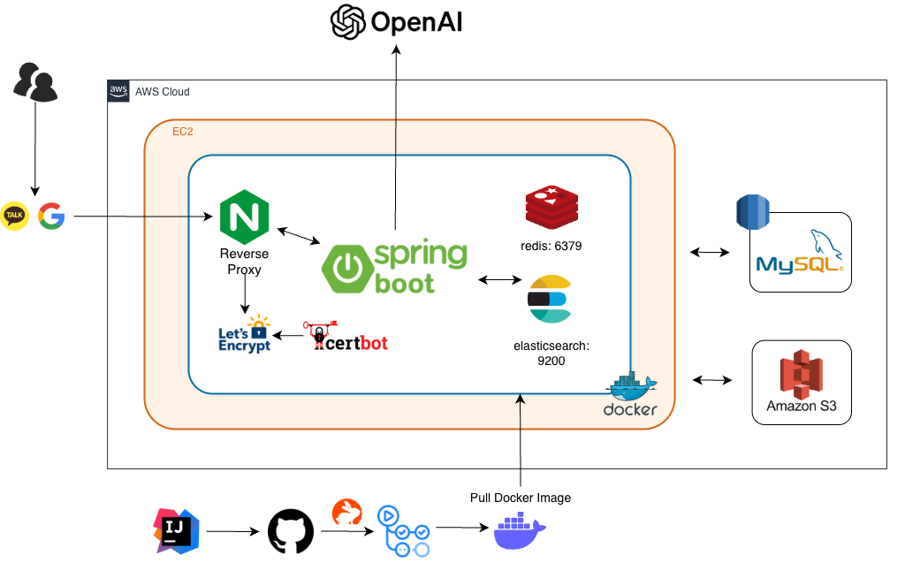

# 온길 Backend

**시니어를 위한 쇼핑 플랫폼, 온길의 백엔드 서버입니다.**

<br/>


[](https://github.com/IT-Cotato/12th-OnGil-BE/actions/workflows/ci-cd.yml)

<div align="center">


</div>

<br/>

## 📌 목차

- [프로젝트 소개](#-프로젝트-소개)
- [주요 기능](#-주요-기능)
- [기술 스택](#-기술-스택)
- [시스템 아키텍처](#-시스템-아키텍처)
- [프로젝트 구조](#-프로젝트-구조)
- [시작하기](#-시작하기)
- [환경 변수](#-환경-변수)
- [API 문서](#-api-문서)
- [커밋 컨벤션](#-커밋-컨벤션)
- [팀원 소개](#-팀원-소개)

<br/>

## 🛍️ 프로젝트 소개

온길은 **시니어 사용자**의 접근성과 편의성을 최우선으로 설계된 커머스 플랫폼입니다.

큰 글씨, 직관적인 탐색 흐름, 음성 검색 등 시니어 친화적 기능을 제공하며
상품 탐색부터 장바구니, 주문/결제, 리뷰, 마이페이지까지 하나의 흐름으로 연결됩니다.

```
탐색 / 검색  →  장바구니  →  주문 / 결제  →  리뷰 / 마이페이지
```

<br/>

## ✨ 주요 기능

**🔐 인증**
- 이메일 / 비밀번호 로그인
- 카카오 · 구글 OAuth2 소셜 로그인
- JWT + Redis 기반 Refresh Token 관리

**🔍 검색**
- Elasticsearch 풀텍스트 검색 (한국어 노리 형태소 분석기)
- AI 기반 유사 상품 추천 (OpenAI)
- 최근 검색어 저장 / 검색어 유사도 보정 (Apache Commons Text)

**🛒 커머스**
- 상품 목록 / 상세 / 카테고리 / 브랜드 조회
- 장바구니 담기 · 수정 · 삭제
- 주문 생성 · 목록 · 상세 · 취소

**⭐ 리뷰**
- 단계형 리뷰 작성 (사이즈 / 소재 / 색상 등 항목별 답변)
- AI 기반 리뷰 자동 생성 및 요약
- "도움돼요" 반응 토글

**🔔 알림**
- 가격 할인 알림 등록 · 조회 (Price Alert)
- SSE(Server-Sent Events) 기반 실시간 알림 전송
- Spring Scheduler로 30초 간격 가격 모니터링

**📰 매거진**
- 시니어 관련 뉴스 자동 크롤링 (Jsoup + Spring Scheduler)
- 매거진 북마크 · 댓글 · 댓글 좋아요

**👤 사용자**
- 배송지 관리 (등록 · 수정 · 삭제 · 기본 설정)
- 찜(위시리스트) 관리
- 프로필 이미지 업로드 (AWS S3)
- 체형 정보 (키 · 몸무게 · 상의 · 하의 · 신발 사이즈) 입력

**🖥️ 어드민**
- 상품 / 배너 / 광고 관리
- 상품 Elasticsearch 인덱싱

<br/>

## 🛠 기술 스택

| Category | Stack |
|----------|-------|
| Language | Java 17 |
| Framework | Spring Boot 3.3.5, Spring Security, Spring Data JPA |
| Database | MySQL 8.0 (AWS RDS) |
| Cache | Redis 7 (Refresh Token, 캐싱) |
| Search | Elasticsearch 8.10 (노리 형태소 분석기) |
| Storage | AWS S3 |
| Auth | JWT, OAuth2 (Kakao, Google), FeignClient |
| AI | OpenAI API (상품 추천, 리뷰 생성) |
| Realtime | SSE (Server-Sent Events), WebSocket |
| Crawling | Jsoup, Spring Scheduler |
| Infra | AWS EC2, Docker Compose, Nginx, Let's Encrypt / Certbot |
| CI/CD | GitHub Actions → Docker Hub → EC2 |
| Docs | Swagger (springdoc-openapi) |
| Etc | Apache Commons Text (검색어 유사도), CodeRabbit (AI 코드 리뷰) |

<br/>

## 🏗 시스템 아키텍처

<div align="center">
  
</div>

<br/>

**인프라 요약**
- **Nginx**: 리버스 프록시, HTTPS 종단 처리
- **Let's Encrypt + Certbot**: SSL 인증서 자동 발급 및 갱신
- **Spring Boot** (8080): 메인 애플리케이션 서버
- **Redis** (6379): Refresh Token 저장, 응답 캐싱
- **Elasticsearch** (9200): 상품 검색 인덱스 (노리 플러그인 적용)
- **MySQL** (AWS RDS): 운영 데이터베이스
- **AWS S3**: 이미지 파일 저장소

**CI/CD 흐름**
```
IntelliJ IDEA  →  GitHub  →  GitHub Actions  →  Docker Hub  →  EC2 Pull & Deploy
```

<br/>

## 📁 프로젝트 구조

```
src/main/java/com/ongil/backend/
├── domain/
│   ├── auth/          # 인증 (JWT, OAuth2 - Kakao/Google)
│   ├── user/          # 회원 정보, 체형 정보
│   ├── product/       # 상품 조회, AI 소재 추천
│   ├── search/        # Elasticsearch 검색, AI 검색, 검색 로그
│   ├── cart/          # 장바구니
│   ├── order/         # 주문
│   ├── payment/       # 결제
│   ├── review/        # 리뷰 작성, AI 리뷰 생성
│   ├── wishlist/      # 찜
│   ├── address/       # 배송지
│   ├── pricealert/    # 가격 할인 알림 (Scheduler)
│   ├── notification/  # SSE 실시간 알림
│   ├── magazine/      # 매거진 (크롤링, 댓글, 북마크)
│   ├── brand/         # 브랜드
│   ├── category/      # 카테고리
│   ├── banner/        # 배너
│   ├── advertisement/ # 광고
│   └── admin/         # 어드민
└── global/
    ├── config/        # Security, Redis, S3, WebSocket, Async 설정
    ├── security/jwt/  # JWT 필터, 토큰 발급
    ├── openai/        # OpenAI 클라이언트
    └── common/        # 공통 응답, 예외, 유효성 검사
```

<br/>

## 🚀 시작하기

### 사전 요구사항

```bash
java --version   # 17 이상
mysql --version  # 8.0 이상
docker --version # Docker & Compose
```

### 로컬 실행

```bash
# 1. 클론
git clone https://github.com/IT-Cotato/12th-OnGil-BE.git
cd 12th-OnGil-BE

# 2. DB 생성
mysql -u root -p
CREATE DATABASE ongil CHARACTER SET utf8mb4 COLLATE utf8mb4_unicode_ci;

# 3. 환경변수 설정 (.env 파일 생성)

# 4. 실행
chmod +x ./gradlew
./gradlew bootRun --args='--spring.profiles.active=local'
```

### Docker Compose (전체 스택)

```bash
docker-compose up -d
```

### 프로덕션 빌드

```bash
./gradlew clean build -x test
java -jar build/libs/backend-0.0.1-SNAPSHOT.jar --spring.profiles.active=prod
```

<br/>

## 🔧 환경 변수

프로젝트 루트에 `.env` 파일을 생성합니다.

| Key | 설명 |
|-----|------|
| `LOCAL_DB_URL` | 로컬 MySQL JDBC URL |
| `LOCAL_DB_USERNAME` | 로컬 DB 사용자 |
| `LOCAL_DB_PASSWORD` | 로컬 DB 비밀번호 |
| `PROD_DB_URL` | 운영 MySQL JDBC URL |
| `PROD_DB_USERNAME` | 운영 DB 사용자 |
| `PROD_DB_PASSWORD` | 운영 DB 비밀번호 |
| `JWT_SECRET` | JWT 서명 시크릿 키 (256bit 이상) |
| `KAKAO_CLIENT_ID` | 카카오 OAuth 앱 키 |
| `KAKAO_CLIENT_SECRET` | 카카오 OAuth 시크릿 |
| `KAKAO_REDIRECT_URI` | 카카오 콜백 URI |
| `GOOGLE_CLIENT_ID` | 구글 OAuth 클라이언트 ID |
| `GOOGLE_CLIENT_SECRET` | 구글 OAuth 시크릿 |
| `GOOGLE_REDIRECT_URI` | 구글 콜백 URI |
| `OPENAI_API_KEY` | OpenAI API 키 |
| `SPRING_DATA_REDIS_HOST` | Redis 호스트 |
| `SPRING_DATA_REDIS_PORT` | Redis 포트 (기본: 6379) |
| `SPRING_ELASTICSEARCH_URIS` | Elasticsearch URI |
| `AWS_ACCESS_KEY` | AWS IAM 액세스 키 |
| `AWS_SECRET_KEY` | AWS IAM 시크릿 키 |
| `AWS_S3_BUCKET` | S3 버킷 이름 |

<br/>

## 📄 API 문서

서버 실행 후 Swagger UI에서 전체 API를 확인할 수 있습니다.

```
http://localhost:8080/swagger-ui/index.html
```

<br/>

## 📝 커밋 컨벤션

```
feat    : 새로운 기능
fix     : 버그 수정
refactor: 코드 리팩토링
docs    : 문서 수정
style   : 포맷팅
test    : 테스트
chore   : 빌드 / 설정
```

```bash
# 예시
feat: 가격 할인 알림 SSE 전송 구현
fix: 검색 결과 페이징 오류 수정
```

<br/>

## 👥 팀원 소개

<table align="center">
  <tr>
     <td align="center" width="160">
      <a href="https://github.com/marshmallowing">
        
      </a>
      <br/>
      <a href="https://github.com/marshmallowing"><b>정유진</b></a>
      <br/>
      <sub>Backend Developer</sub>
    </td>
    <td align="center" width="160">
      <a href="https://github.com/kangcheolung">
        
      </a>
      <br/>
      <a href="https://github.com/kangcheolung"><b>강철웅</b></a>
      <br/>
      <sub>Backend Developer</sub>
    </td>
    <td align="center" width="160">
      <a href="https://github.com/neibler">
        
      </a>
      <br/>
      <a href="https://github.com/neibler"><b>조형준</b></a>
      <br/>
      <sub>Backend Developer</sub>
    </td>
  </tr>
</table>

<br/>

